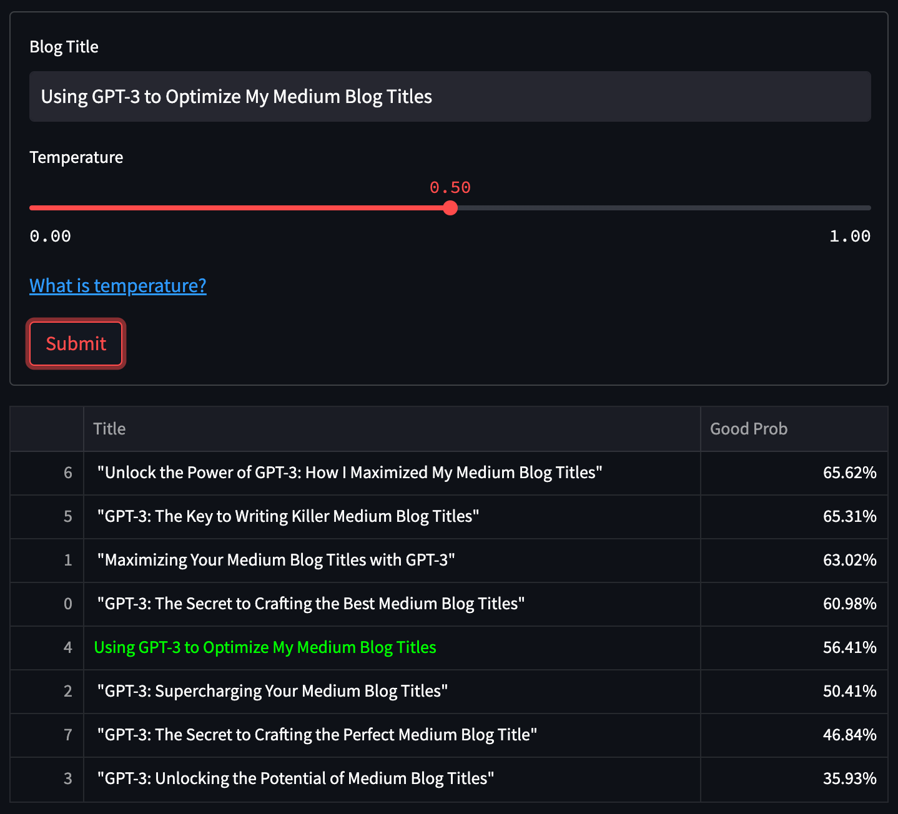
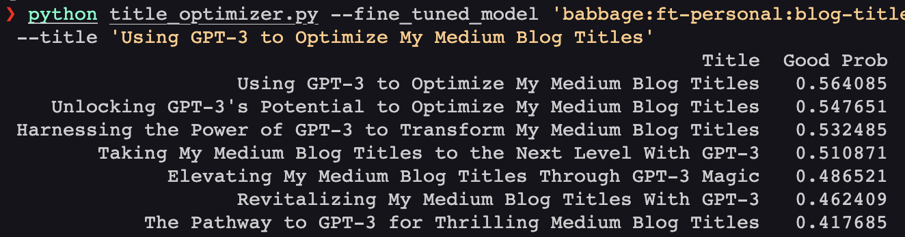

# Medium Blog Title Optimizer

I write [blog posts](https://benedictxneo.medium.com/) on Medium and often times I have trouble coming up with a good title. It's the most important part as it is the first thing a reader sees. Since GPT3 is trained on the entire internet, I decided to create a program that would help me optimize my blog post titles.

This is hugely inspired by [@minimaxir](https://github.com/minimaxir)'s blog post [How to Create a Blog Post Title Optimizer with GPT-3 and Hacker News Data](https://minimaxir.com/2022/08/gpt3-blog-title-optimizer/) except I'm using Medium blogs titles as the training data and I created a streamlit app to make it easier to use. It also utilizes Harrison's [medium scraper code](https://github.com/harrisonjansma/Medium_Scraper) which was modified to suit my purposes. I also decided to try out Weights and Biases to track my experiments and log the results as artifacts which was a good learning experience on MLOps.

## Table of Contents

- [Medium Blog Title Optimizer](#medium-blog-title-optimizer)
  - [Table of Contents](#table-of-contents)
  - [Screenshots](#screenshots)
  - [Dataset](#dataset)
    - [Data collection](#data-collection)
    - [data preprocessing](#data-preprocessing)
    - [Ingesting data to bigquery](#ingesting-data-to-bigquery)
    - [Generating the prompts](#generating-the-prompts)
  - [Fine Tuning and experiment tracking with wandb](#fine-tuning-and-experiment-tracking-with-wandb)
  - [Metrics](#metrics)
    - [Classification Metrics](#classification-metrics)
    - [Token and Sequence Accuracy](#token-and-sequence-accuracy)
  - [Inference](#inference)
  - [prompting and optimizing](#prompting-and-optimizing)
  - [Usage](#usage)
    - [Create conda environment](#create-conda-environment)
    - [Install dependencies](#install-dependencies)
    - [Scrape data](#scrape-data)
    - [Preprocess the data](#preprocess-the-data)
    - [Generate prompts](#generate-prompts)
    - [fine tune model](#fine-tune-model)
    - [1. run streamlit app](#1-run-streamlit-app)
      - [Running with docker](#running-with-docker)
    - [2. run in terminal](#2-run-in-terminal)
  - [Development](#development)
    - [Install dev dependencies](#install-dev-dependencies)
    - [pre-commit setup](#pre-commit-setup)
  - [Future work](#future-work)

## Screenshots



Here's the output if you decide to run it in the terminal instead.



## Dataset

### Data collection

The dataset was obtained by scraping [Medium.com](https://medium.com/). The code for the scraping can be found in [`src/data`](src/data) which was modified from Harrison's code

I ran the scraper from `2018/01/01` to `2022/10/01` and targeted the following categories: `["data-science", "machine-learning", "python", "programming", "technology"]` and obtained the information below.

- `title` - title of the article
- `claps` - no. of claps
- `read_time` - read time of the article (minutes)
- `author` - author of the article
- `publication` - publication of the article (e.g. Towards Data Science)
- `url` - url of the article

I experimented with concurrent scraping with a `ThreadPoolExecutor` but I was facing bot detection issues so I decided to just run it sequentially.

To obtain more data, I exported some already scraped data from this [article](https://khuyentran1476.medium.com/what-i-learned-from-scraping-15k-data-science-articles-on-medium-98a5f252d0aa)

The final dataset had 226,468 articles

### data preprocessing

I performed some basic EDA on the dataset and performed the following cleaning:

- filter export data to match scraped data and merge to create a single dataset
- remove duplicate and missing titles
- convert claps from strings with "K" to integers
- filter only english titles
- filter title length between 30 and 70 characters
- remove titles with "->" to avoid confusion with prompt
- filter claps >= 10

After cleaning, we're left with 71,749 articles.

Doing some analysis, I determined `>=200` claps as a good cutoff point for a "good" article as it gives us 16k articles and is a pretty good clap count for a medium article.

> One thing to watch out for is that a person can clap 50 times per article, so maybe normalizing/accounting for that would be better, it's not as straightforward as a single upvote on hackernews. But let's move forward.

The operations above can be found in [`01_eda_cleaning.ipynb`](notebooks/01_eda_cleaning.ipynb) and compiled into a script in [`preprocess.py`](src/data/preprocess.py)

### Ingesting data to bigquery

I decided to use bigquery to store the data as it's a good way to store large amounts of data and it's easy to query. I used the google cloud sdk and the pandas_gbq package to upload the data to bigquery.

Then, I wrote sql code to filter articles with claps >= 200, and then randomly sample "bad" articles with claps < 200 to create a balanced dataset.

At the end, we end up with exactly ~33k articles: 16k good articles and 16k bad articles.

Code for this part is in [`gpt3-prompts.sql`](src/features/gpt3-prompts.sql) and [`generate_prompts.py`](src/features/generate_prompts.py)

### Generating the prompts

OpenAI’s finetuning API takes in a JSONL (jsonlines) file where each line is a JSON object with two fields:

- `prompt` - the blog title prepended with "Title: " and a "->" suffix to "align" it better with GPT-3
- `completion` - the good/bad label

Here's what the looks like in the end.

```text
{"prompt":"Title: Literally Nobody Voted in the Quincy Midterm Elections ->","completion":" good"}
{"prompt":"Title: Neural Networks: Is Your Brain Like A Computer? ->","completion":" good"}
{"prompt":"Title: Must have MacBook apps for productivity ->","completion":" good"}
```

Now the fine-tuning begins

## Fine Tuning and experiment tracking with wandb

Weights and Biases has a great integration with OpenAI to log results easily, so I took advantage of that.

After setting up my [wandb project](https://wandb.ai/benneo/GPT-3%20blog%20title), I split the dataset with the openai cli which created a training data set with 32373 prompts and a validation set with 1000 prompts.

The dataset were then logged as artifacts into wandb to be used for training later. This way the dataset used to finetune is tracked and makes the result reproducible.

The fine-tuning was done with two different models - "ada" and "babbage" and I experimented a little with the `prompt_loss_weight` and `learning_rate_multiplier` parameters.

Check out the [`02_GPT3_finetune_wb`](notebooks/02_GPT3_finetune_wb.ipynb) for the fine tuning process.

Below are the results of the fine-tuning.

## Metrics

Here are the parameters of the models I fine-tuned with their training time and cost. I used the same training data for all of them.

- `adav1` - plain Ada (13 mins) ($0.74)
- `adav2` - Ada with `prompt_loss_weight=0.1` (17 mins) ($0.74)
- `adav3` - Ada with `prompt_loss_weight=0.1` and `learning_rate_multiplier=0.2` (9 mins) ($0.74)
- `babbage` - babbage with `prompt_loss_weight=0.1` (38 mins) ($1.11)

### Classification Metrics

|         |     f1.0 | accuracy |   recall | precision |    auprc |    auroc |
| :------ | -------: | -------: | -------: | --------: | -------: | -------: |
| adav1   | 0.595238 |    0.592 | 0.603622 |  0.587084 | 0.604722 | 0.631859 |
| adav2   | 0.586207 |    0.592 | 0.581489 |  0.591002 | 0.609321 | 0.627381 |
| adav3   | 0.602687 |    0.586 | 0.631791 |  0.576147 | 0.595404 | 0.619944 |
| babbage | 0.598169 |    0.605 | 0.591549 |  0.604938 | 0.600456 | 0.626093 |

### Token and Sequence Accuracy

|         | training_token_acc | validation_token_acc | training_sequence_acc | validation_sequence_acc |
| :------ | -----------------: | -------------------: | --------------------: | ----------------------: |
| adav1   |           0.664062 |             0.613281 |              0.664062 |                0.613281 |
| adav2   |           0.699219 |             0.578125 |              0.699219 |                0.578125 |
| adav3   |            0.65625 |             0.574219 |               0.65625 |                0.574219 |
| babbage |           0.671875 |             0.652344 |              0.671875 |                0.652344 |

Code to obtain metrics is in [`02_GPT3_metrics.ipynb`](notebooks/02_GPT3_metrics.ipynb)

View the [wandb report of the metrics](https://wandb.ai/benneo/GPT-3%20blog%20title/reports/GPT-3-Fine-Tuning-on-Medium-Blog-Titles--VmlldzozMDY1OTg3)

## Inference

I decided to choose the babbage model as it the best accuracy and the fact that it's a more powerful model.

Since everything was logged with wandb, I was able to easily load the model with `use_artifact` and run inference on the validation set.

Here is inference done on 10 validation prompts.

|                              prompt                              | target | pred |  good_prob  |
| :--------------------------------------------------------------: | :----: | :--: | :---------: |
|        Title: Making serverless variables work for you ->        |  good  | bad  | 0.491576115 |
| Title: The Beginners Guide to Similarity Matching Using spaCy -> |  good  | good | 0.622321792 |
|     Title: How we crafted a career development framework ->      |  good  | good | 0.511328059 |
|         Title: Photographers are obsolete. Are they? ->          |  good  | good | 0.502482633 |
|         Title: 5 Cool AI-Powered Drug Discovery Tools ->         |  good  | bad  | 0.411839283 |
|          Title: Solving XOR with a single Perceptron ->          |  good  | good | 0.579067186 |
|           Title: A Beginners Guide: Cryptocurrency ->            |  good  | good | 0.713198326 |
| Title: These are the highest paying freelance skills in 2021 ->  |  good  | good | 0.542596982 |
|   Title: The Secret Behind How Chinese Startups are Winning ->   |  good  | good | 0.63539651  |
|      Title: Changing sync web server to async in 2 hours ->      |  good  | good | 0.501522153 |

I wonder what the model looks at to make the decision.

Code to perform inference is in [`03_GPT3_log_inference`](notebooks/03_GPT3_log_inference.ipynb)

## prompting and optimizing

With a model that gives me a score for whether a title is good or bad, I just need GPT-3 to generate blog titles for me.

I modified the base prompt from @minimaxir to `Rewrite the following blog post title into 6 different titles but optimized for virality and quality`.

I thought of having it suggest 10 but it was just replacing some words with synonyms and it wasn't suggesting anything new.

Sometimes the prompt generates a numbered prefix, so I remove it before passing it fine-tuned model.

I packaged the code for prompting and optimizing into a function that takes in a prompt and returns a list of 6 titles in [`title_optimizer.py`](src/model/title_optimizer.py)

## Usage

Before using the app, there are a couple things you have to setup

- get export data from this [article](https://khuyentran1476.medium.com/what-i-learned-from-scraping-15k-data-science-articles-on-medium-98a5f252d0aa)
- download chromedriver from this [page](https://chromedriver.chromium.org/downloads) (note the version)
- setup big query
  - get credential json with this [guide](https://developers.google.com/workspace/guides/create-credentials) and copy the path to the json file
  - create a dataset and table in big query (make sure the name matches with what's in the [generate_prompts.py](src/features/generate_prompts.py)
- Get an OpenAI API key from [here](https://beta.openai.com/docs/developer-quickstart)
- create and add the key and json path to .env file (see [.env.example](.env.example))

To get the data, first setup the environment

### Create conda environment

```bash
conda create -n blog_title python=3.9
conda activate blog_title
```

### Install dependencies

```bash
pip install -r requirements.txt
```

### Scrape data

Configure the date and tags according to your preference and run the scraper script

```bash
cd src/data
python scraper.py
```

This populates the `data/0_raw` folder with `medium.csv`

### Preprocess the data

Before running this, you need to have the export data downloaded and named as `export.csv` and placed in the `data/0_external` folder.

```bash
python preprocess.py
```

This populates:

- `data/1_interim` folder with `clean_df.parquet`
- `data/2_final` folder with`final_df.csv`

### Generate prompts

Now, run the code below to ingest data into bq and generate prompts

```bash
python generate_prompts.py
```

This populates `data/2_final` folder with `prompts.jsonl`

### fine tune model

Follow the instructions in [02_GPT3_finetune_wb](notebooks/02_GPT3_finetune_wb.ipynb) to fine tune the model and log the results to wandb.

Here is an example of using the cli to fine tune the model

```bash
!openai api fine_tunes.create \
    -t <TRAIN_FILE_ID> \ # or path to file
    -v <VALID_FILE_ID> \
    -m "babbage" \
    --n_epochs 4 \
    --batch_size 256 \
    --classification_n_classes 2 \
    --suffix "blog title scorer" \ # custom suffix for model
    --classification_positive_class " good" \
    --compute_classification_metrics
```

Some useful commands

```bash
# List all created fine-tunes
openai api fine_tunes.list

# follow a specific fine-tuning progress
openai api fine_tunes.follow <YOUR_FINE_TUNE_JOB_ID>

# get status
openai api fine_tunes.get -i <YOUR_FINE_TUNE_JOB_ID>

# Cancel a job
openai api fine_tunes.cancel -i <YOUR_FINE_TUNE_JOB_ID>
```

Once you have your fine-tuned model, you can run the app in two ways.

### 1. run streamlit app

Note it should show some wandb logs as I've set it up where every prediction is also logged to wandb.

```bash
cd src/app
streamlit run app.py
```

#### Running with docker

```bash
cd src/app
docker build -t streamlit .
```

You should see a streamlit image when u run `docker images`

```bash
docker run -p 8501:8501 blog_title
```

### 2. run in terminal

You can also opt to run the script and display the results in the terminal.

```bash
cd src/model

python title_optimizer.py \
  --fine_tuned_model <FINE_TUNED_MODEL_NAME> \
  --title <TITLE>
```

## Development

### Install dev dependencies

```bash
pip install -r requirements_dev.txt
```

### pre-commit setup

```bash
pre-commit install
```

## Future work

- [ ] Experiment with different hyperparameters
- [ ] Learn more about what token and sequence accuracy is and how to choose the best model
