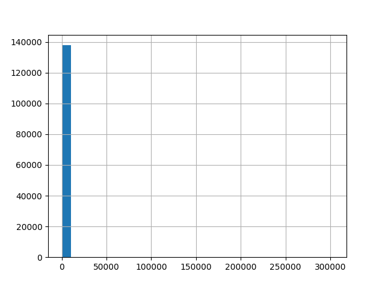
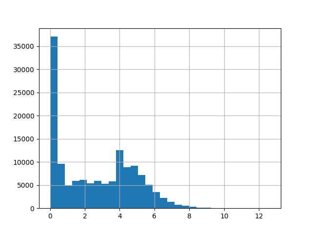
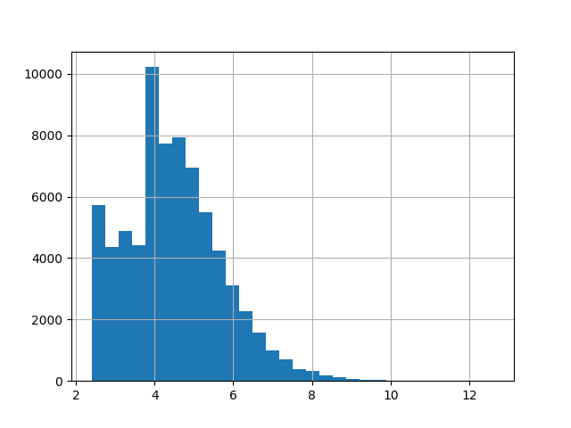
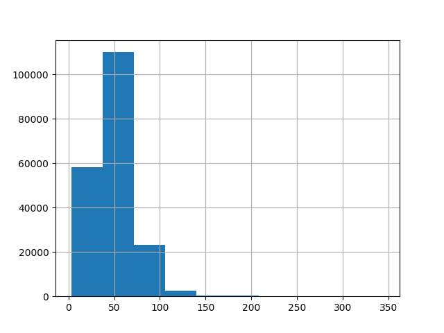
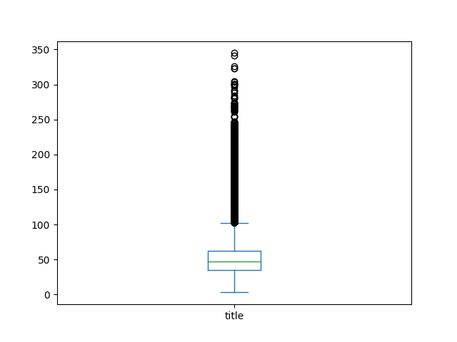
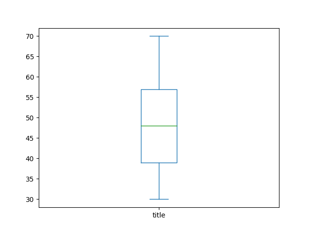
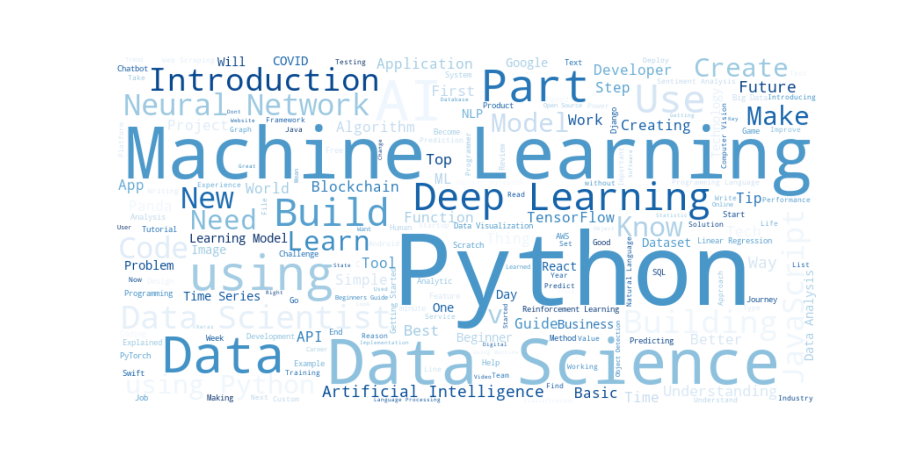
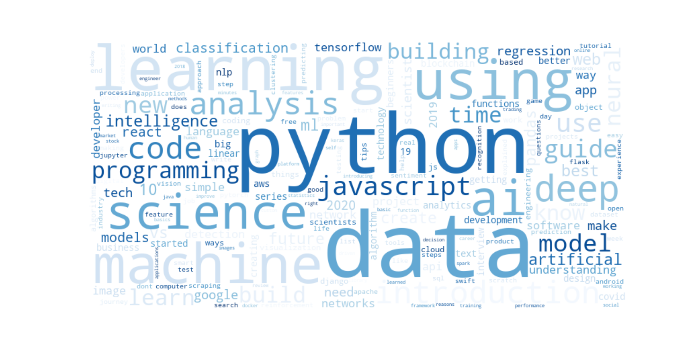

# EDA

Here are some plots generated from the eda_cleaning notebook in the notebooks folder.

## Distribution of claps

## Distribution of claps (log scale)

## Distribution of claps (log scale and filtered)

## Distribution of title length

## Distribution of title length (filtered)

## Word clouds of titles

## bag of words

### weighted by tf-idf

